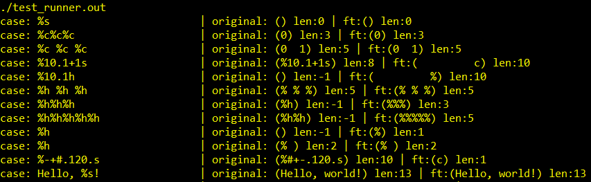
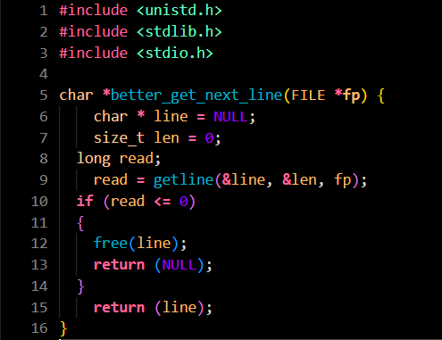
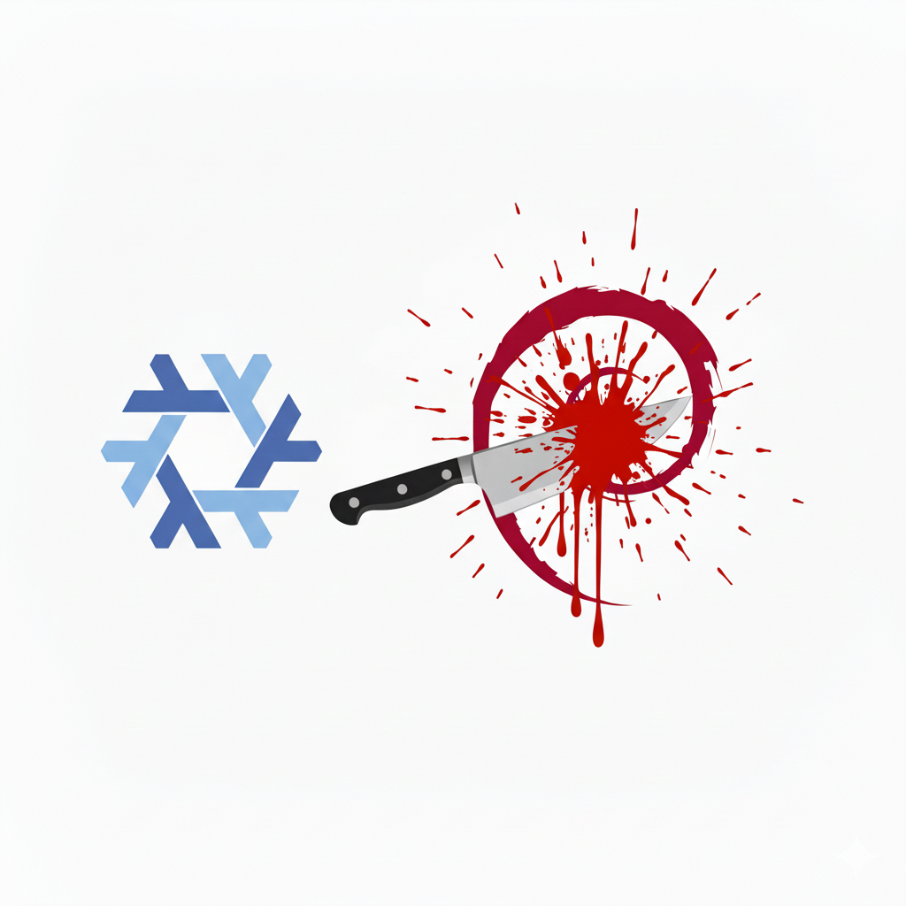
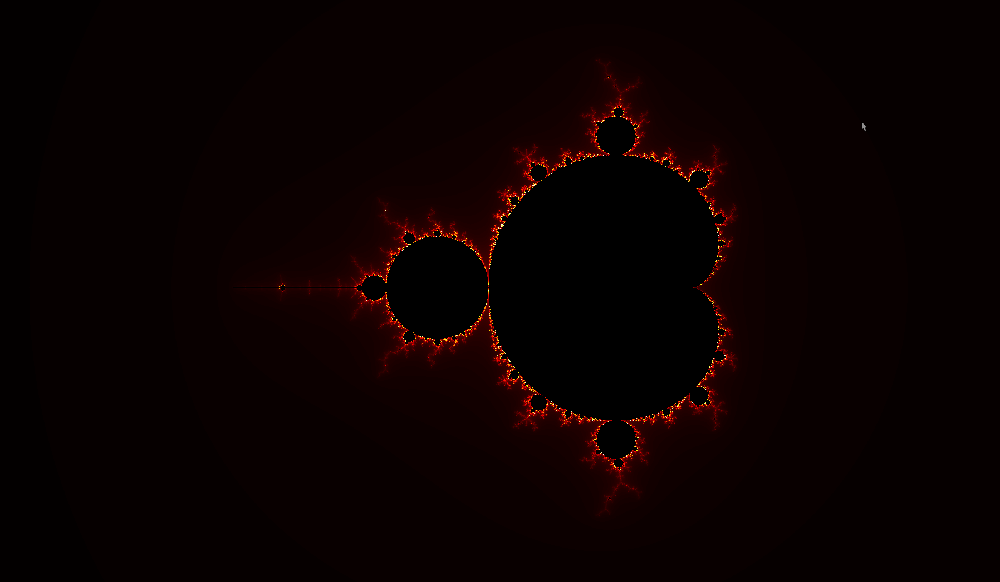
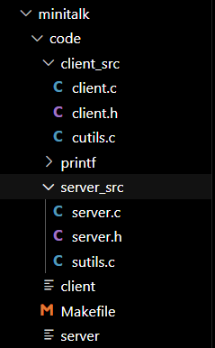

# 42Warsaw Core C Projects

## Description
This repository contains projects I made from the C Common Core at 42Warsaw. I started the curriculum at 22.09.2025, currently ongoing.

### Libft
This project was about reimplementing core C functions, and writing other utilities. The scope contained pointer manipulations, string comparison and searching, data type conversion, file operations, and linked lists. It served as a base for future projects. Many things can go wrong when null is the input to your function.

### Printf
A recode of the original printf function. I considered two approaches, printing the charachters one by one, or creating a formatted string before printing. I implemented the second one to possibly use the formatting in a future project. The basic code flow follows like this: The data of all specifiers is extracted, converted to strings. Then for further formatting the subflags are applied, and finally the pieces are combined into one string.

### GNL
The premise of this project was to read a file line by line, with the use of a static buffer variable. Initially I tried to encapsulate the variable using the singleton pattern, but that proved to take too much space to implement the bonus. To do it I recoded the implementation using a simple matrix of file descriptors to store all possible file read residue.

### BTBR
This was a systems architechture project, which revolved around setting up and configuring a debian instance. I've learned more about bash commands, but besides that It was a chore to research everything.

### push_swap
The premise to create an optimal sorting algorithm was interesting at first. Initiall implementation resolved around calculating the most optimal move the program could make at the current moment. The move was the seqence of operations on both stacks to push the number to the correct spot in the target stack. However this implementation was not enough to pass the benchmarks, so I added backtracking logic to recursively check other paths.
Since that was not enough, I started to experiment with other approaches to improve the operation count, mainly presorting. I implemented LIS (Largest increasing seqence) detection, but that was not enough, so I in the end I decided on the divide and conquer algorithm.
    

### fract-ol
My favourite C project that I made. First, the topic itself was intriguing, allowing me to learn new math concepts. Second, it was a graphical project, so naturally I picked my favourite warm-fire color pattern. Third, less input validation, I was getting sick of it. The implementation proceeded smoothly, although the limitations of the minilibx library and not being able to use multithreading constrained the performance. I manged to implement a cool way to explore the Julia fractal variations, all you need to do is to just click on the corresponding mandelbrot pixel. This opens a new window for the given complex number coordinates. Lastly I added the Buring ship and julia fractals.

### minitalk
Introduced the way processes can communicate with each other - signals, but didn't expand on it. The scope was to create a basic communication between a server and a client for text transfer. Having only two signals available, the chars had to be encoded into binary on the client side and decoded for printing on the server side. To ensure loseless transfer, when the server recieves a signal, it sends a confirmation. The client waits for this confirmation before sending another bit.

## Reflections on the 42 C Program
Soon
